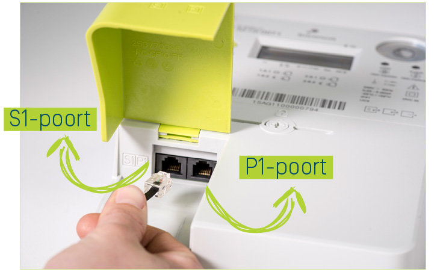

# power-readout

Project that can read out digital electricity meters from a P1 port using the `DSMR 5.0.2` standard.  

This application should work with the following device types:

- S211
- T211
- G4
- G6

The port on the meter follows the `RS422` standard, so any RS422 to USB cable will work.



The P1 port will send it's data every second and will update gas usage every 5.

## Usage

There are 2 ways to use this project, scrape the data from a web endpoint or read directly from `/dev/ttyUSB0`.  

### Reading directly from the serial port

When reading directly from the serial port the data is read and made available on the `/metrics` endpoint on port 80.

When running from docker make sure to pass through the `/dev/ttyUSB0` device.

## Reading form a web endpoint

It's not always desirable to run this web server on the same device.  
For example when a micro controller is used.  
A python script is included in `./src/read_p1.py` that can read out the data and put it in a file.  
All you then need is a small web server to host the file.  

## Prometheus

This web service exports the information in the /metrics endpoint as `JSON`.  
Prometheus is a timed based database that needs to scrape in a different format.  

The [prometheus-json-exporter](https://github.com/prometheus-community/json_exporter) can be used for this purpose.

A sample configuration that exposes most data:

```
---
      metrics:
      - name: l1_power_usage
        type: object
        help: L1 Power Usage
        path: '{.l1_power_usage}'
        labels:
          unit: '{.unit}'
        values:
          value: '{.value}'

      - name: l1_power_generated
        type: object
        help: L1 Power Generated
        path: '{.l1_power_generated}'
        labels:
          unit: '{.unit}'
        values:
          value: '{.value}'

      - name: l1_amperage
        type: object
        help: L1 Current Line Amparage
        path: '{.l1_amperage}'
        labels:
          unit: '{.unit}'
        values:
          value: '{.value}'

      - name: l1_voltage
        type: object
        help: L1 Current Line Voltage
        path: '{.l1_voltage}'
        labels:
          unit: '{.unit}'
        values:
          value: '{.value}'

      - name: power_used_tariff_1
        type: object
        help: Total Power Used for Tarif 1
        path: '{.power_used_tariff_1}'
        labels:
          unit: '{.unit}'
        values:
          value: '{.value}'

      - name: power_used_tariff_2
        type: object
        help: Total Power Used for Tarif 2
        path: '{.power_used_tariff_2}'
        labels:
          unit: '{.unit}'
        values:
          value: '{.value}'

      - name: total_power_used
        type: object
        help: Total Power Used
        path: '{.total_power_used}'
        labels:
          unit: '{.unit}'
        values:
          value: '{.value}'

      - name: total_power_generated
        type: object
        help: Total Power Generated
        path: '{.total_power_generated}'
        labels:
          unit: '{.unit}'
        values:
          value: '{.value}'

      - name: gas_used
        type: object
        help: Total Gas Used
        path: '{.gas_used}'
        labels:
          unit: '{.unit}'
        values:
          value: '{.value}'
```

The `prometheus` scrape target is then:

```
     - job_name: power-exporter
        metrics_path: /probe
        static_configs:
          - targets:
            - https:/<hostname>>/metrics
        relabel_configs:
          - source_labels: [__address__]
            target_label: __param_target
          - source_labels: [__param_target]
            target_label: instance
          - target_label: __address__
            replacement: <real hostname:port> ## Location of the json exporter's real <hostname>:<port>
```

## Additional Information

- https://jensd.be/1183/linux/read-data-from-the-belgian-digital-meter-through-the-p1-port]